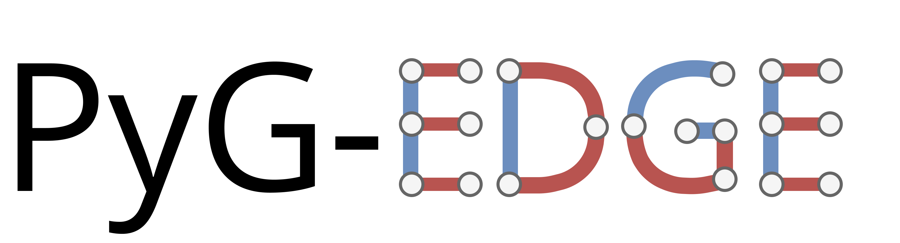

# PyTorch-Geometric Edge




PyTorch-Geometric Edge (PyGE) is a library that implements models for learning vector
representations of graph edges. It is build upon the popular [PyG](https://github.com/pyg-team/pytorch_geometric)
library and allows to mix layers and models from both libraries in the same code.
Note that PyGE is still under development and model APIs may change in future revisions.


## Installation
Currently, we test our code using Python 3.8, but newer versions should work 
fine as well. We plan to extend our test suite in upcoming releases. The same
applies for the PyTorch version – we currently run our tests using PyTorch 1.10.0.

For a detailed list of required packages, please take a look at the `setup.py`
file, where library versions are constrained.

You can install PyGE using pip:

```bash
$ pip install torch-geometric-edge
```

## Available models

Currently, we implement the following edge-centric models:
- non-trainable node pair operators: Average, Hadamard, L1, L2
- node2edge and edge2node layers
- Line2vec
- AttrE2vec
- PairE
- Dual Hypergraph Transformation

## License
MIT
